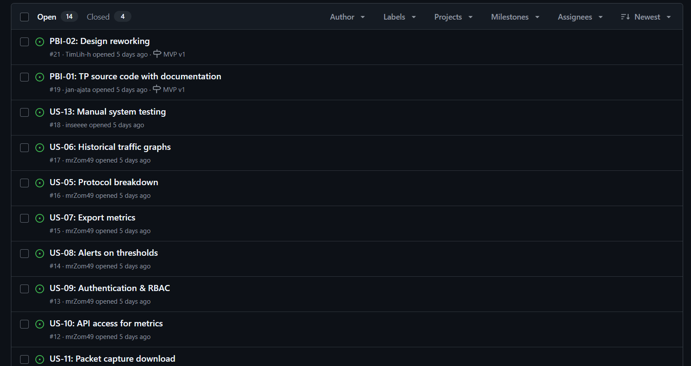
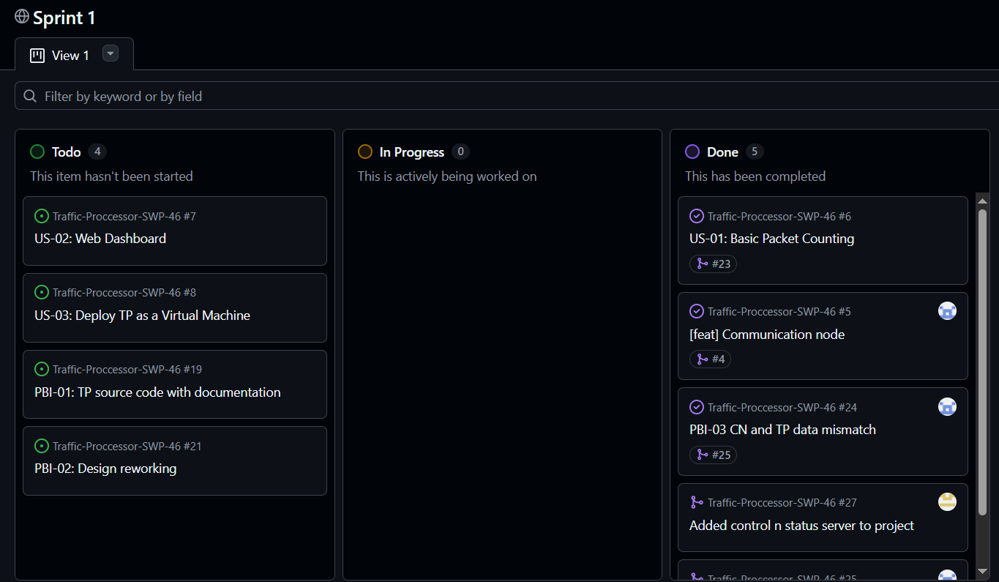
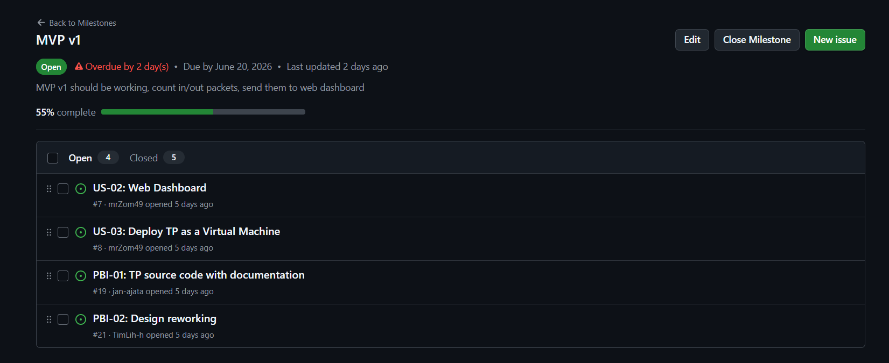
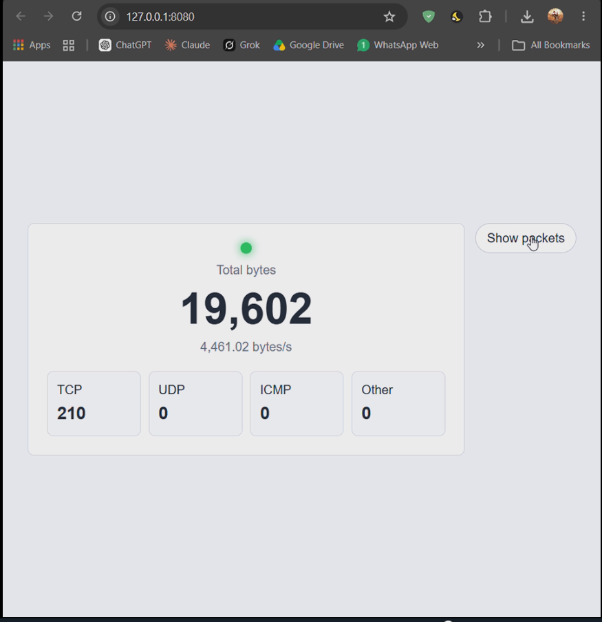
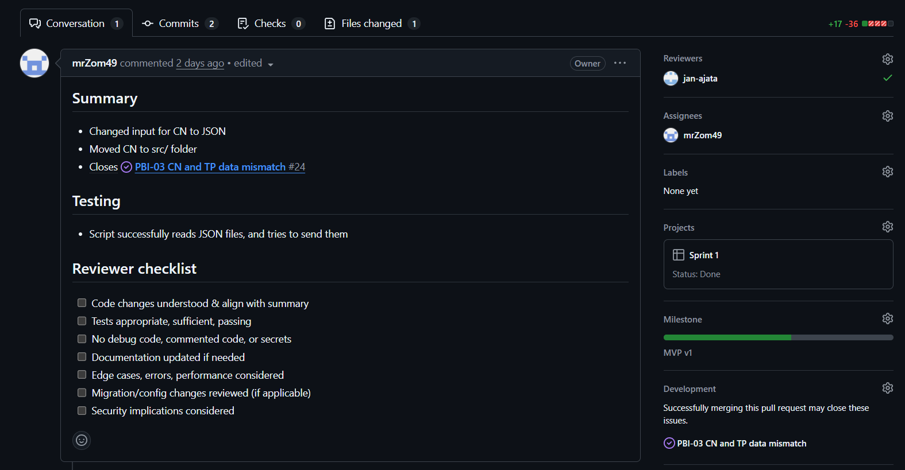

# Week 3 full report

Include:

## Project Information

**Project Name:** Traffic Processor (TP)  
**Short Description:** A network visibility and control tool that captures live packet counters, per-connection statistics, traffic history, and supports blocking, tunneling, and failover behaviours.  
**Root LICENSE:** [LICENSE](/LICENSE)

## Sprint 1 and MVP v1

Summary of the current user-story and PBI scope since Assignment 2, with links to [docs/user-stories.md](/docs/user-stories.md): [Link](https://github.com/mrZom49/Traffic-Proccessor-SWP-46/issues)

[**Report on which customer feedback points from Assignment 2 were addressed in MVP v1**](./customer-review-summary.md)

[**Link to historical reports/week2/user-stories.md**](../week2/user-stories.md).

[**Link to current docs/user-stories.md**](/docs/user-stories.md).

[**Link to the Product Backlog view**](https://github.com/mrZom49/Traffic-Proccessor-SWP-46/issues)

[**Link to the current Sprint Backlog board/view**](https://github.com/users/mrZom49/projects/2/views/1)

[**Link to the current Sprint milestone as the authoritative source for the Sprint Goal, Sprint dates, and current Sprint scope**](https://github.com/mrZom49/Traffic-Proccessor-SWP-46/milestone/1)

**Total Product Backlog size in Story Points: 146**

**Total current Sprint size in Story Points: 11**

[**Link to the MVP version field, filtered view, or equivalent grouped view showing the MVP v1 scope**](https://github.com/users/mrZom49/projects/2)

**Description of the selected MVP v1 scope:**
MVP v1 focuses on the first usable Traffic Processor flow: collecting traffic-related data, exposing it through the backend, and presenting it in the frontend dashboard.

Explanation of PBI types, statuses, priorities, Sprint milestone usage, MVP version tracking, and task-decomposition approach:
We used the same as in [Process requirements](https://gitlab.pg.innopolis.university/swp_26/swp_26/-/blob/main/Process_Requirements.md)

**Short summary of the roadmap direction for the current and next Sprint, with a link to [docs/roadmap.md](/docs/roadmap.md):**
The roadmap is organized by weekly sprints. Sprint 1 focuses on delivering MVP v1: getting TP running, counting packets, sending packet data to the web dashboard, and preparing VM deployment. Sprints 2-4 are scheduled for the following weeks and are reserved for continued development after the MVP v1 foundation is completed.

[**References to the verification evidence for the completed MVP v1 PBIs**](./customer-review-summary.md)

**Summary of the current product status:**
Have basic functionality of counting packets, and traffic processor correctly communicates with the backend.

**Summary of the next steps:**
Update frontend design, add two way packet statistics, address communication between CN and backend.

[**A contribution traceability table mapping each team member to their issues, PRs/MRs, and review activity**](https://github.com/mrZom49/Traffic-Proccessor-SWP-46/pulls?q=is%3Apr+is%3Aclosed)

## Links

SemVer release link is not used because it was desided to be redundant for our purposes.

[**Link to the root CHANGELOG.md**](/CHANGELOG.md).

[**Link to Process_Requirements.md**](https://gitlab.pg.innopolis.university/swp_26/swp_26/-/blob/main/Process_Requirements.md)

[**Link to docs/roadmap.md**](/docs/roadmap.md).

[**Link to docs/definition-of-done.md**](/docs/definition-of-done.md).

## Process and Templates

[**Link to the User Story issue template**](/.github/ISSUE_TEMPLATE/user-story.md).

[**Link to the Other PBIs issue template**](/.github/ISSUE_TEMPLATE/other-pbis.md).

[**Link to the Course Task issue template**](/.github/ISSUE_TEMPLATE/course-task.md).

[**Link to the Bug Report issue template**](/.github/ISSUE_TEMPLATE/bug_report.md).

[**Link to the extended PR/MR template**](/.github/pull_request_template.md).

[**Links to reviewed issue-linked PRs/MRs created during Week 3**](https://github.com/mrZom49/Traffic-Proccessor-SWP-46/pulls?q=is%3Apr+is%3Aclosed)

Link to the delivered MVP v1 deployment, runnable artifact, or equivalent access point: None provided because we still don't have access to university VM. For insturctions on how to run 

[**Link to access or run instructions in the root README.md**](/README.md).

[**Link to the public sanitized video demonstration shorter than two minutes**](https://drive.google.com/file/d/1nrzgyh3xHHNZyZvF-taDIF_7hIf0w5im/view?usp=drive_link)

Embedded screenshots from [reports/week3/images/](./images/) showing:

Product Backlog view

Sprint Backlog view

Sprint milestone

Delivered MVP v1

Example reviewed issue-linked PR/MR

[**Link to the published customer review transcript**](customer-review-transcript.md)

[**Link to the customer review summary**](customer-review-summary.md)

[**Link to the reflection**](reflection.md)

[**Link to the retrospective**](retrospective.md)

[**Link to the LLM Report**](llm-report.md)
